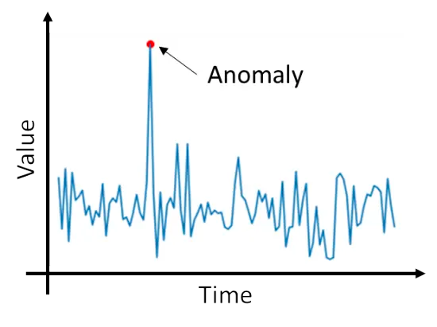

# Genetic-Algorithm-Guided-Satellite-Anomaly-Detection
<p align="center">
  
</p>

## File list:
main.py contains the code of our proposed  Anomaly detection method.
## Background:

## Papers:
The source code for the paper titled "Genetic Algorithm Guided Ensemble of Neural
Networks for Satellite Anomaly Detection", submitted to IEEE Trans. on Aerospace and Electronic Systems, Nov 2023.
### Citation:
There are one main citations for this work.

By default, consider using the following:

```
@Article{Malekisadr2022,
  author="Mohammadamin Malekisadr, Yeying Zhu, Peng Hu",
  title="{Genetic Algorithm Guided Ensemble of Neural
Networks for Satellite Anomaly Detection}",
  journal="IEEE Transactions on Aerospace and Electronic Systems ",
  year="2023",
  month="Nov",
  day="13",
}
```
## Getting Started
These instructions will get you a copy of the project up and running on your local machine for development and testing purposes.

### Before Installing
To ensure a smooth process, please ensure you have the following requirements.

**Hardware**
- Nvidia GPU with Compute Capability 3.5 or higher


**Software**

The following Softwares and Packages are recommended to be used before installation
```
Python: 3.6.1
Numpy: 1.12.1
Pandas: 0.20.1
Keras: 2.0.6
Scikit-Learn: 0.18.1
Theano: 0.9.0
Tensorflow: 1.2.1
Pydot: 1.0.29
GraphViz: 2.38.0
CUDA: 11.0
```
### Installation
Clone this repository, and then install it and its requirements. It should be something similar to this:

```
git clone https://github.com/aminmalekisadr/Genetic-Algorithm-Guided-Satellite-Anomaly-Detection.git
pip3 install -e Genetic-Algorithm-Guided-Satellite-Anomaly-Detection/
pip3 install -r Genetic-Algorithm-Guided-Satellite-Anomaly-Detection/requirements.txt
```


### Dataset

We use the SMD data. The dataset is available [here](https://s3-us-west-2.amazonaws.com/telemanom/data.zip). If the link is broken or something is not working properly, please contact me through email (aminmalekisadr@gmail.com).
## Experiments
### Configuration
Please run the following command at your terminal:
```
python main.py   path_to_config_file  dataset_name  Dimensional_reduction_name 
```

 These parameters are used to setup the Genetic Algorithm, Recurrent Neural Networks and Random Forests, MC dropout used in training for the model.
 
```
mutation_rate = 0.1  # Mutation rate for GA
min_mutation_momentum = 0.0001  # Min mutation momentum
max_mutation_momentum = 0.1  # Max mutation momentum
min_population = 20  # Min population for GA
max_population = 50  # Max population for GA
num_Iterations = 10  # Number of iterations to evaluate GA
look_back = 1  # Num of timespaces to look back for training and testing
max_dropout = 0.2  # Maximum percentage of dropout
max_MC_dropout = 0.2  # Maximum percentage of dropout
min_num_layers = 1  # Min number of hidden layers
max_num_layers = 10  # Max number of hidden layers
min_num_neurons = 10  # Min number of neurons in hidden layers
max_num_neurons = 100  # Max number of neurons in hidden layers
min_num_estimators = 100  # Min number of random forest trees
max_num_estimators = 500  # Max number of random forest trees
rnn_epochs = 1  # Epochs for RNN
```

### Running an Experiment
## Future Direction:
## License
This project is licensed under the MIT License - see the [LICENSE.md](LICENSE.md) file for details
## Acknowledgments:
* **Yeying Zhu** and **Peng Hu**, my research supervisors;
* **University of Waterloo**, who hosted my research;
* **National Research Council Canada**, who funded my Research.


